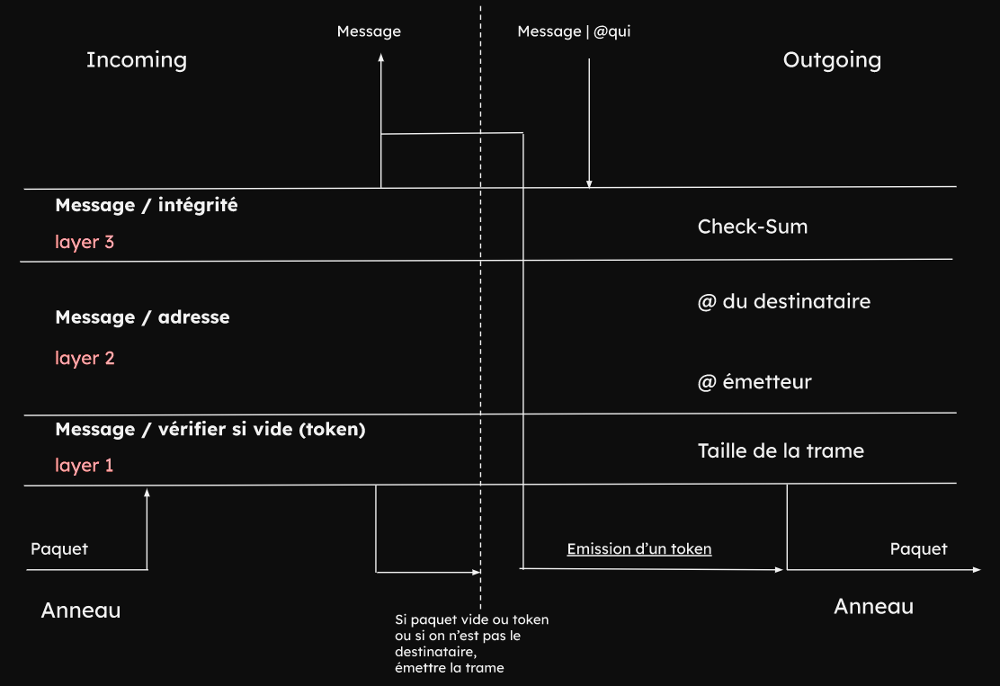

# Projet Réseau

L'objectif de ce TP est de mettre en place un réseau local en C entre plusieurs machines. 

## Auteurs

Le projet a été réalisé par :
* **Nicolas Godard**
* **Emilien L'Haridon**
* **Leo Bigardi**
* **Tanguy Hue**

## Installation

Pour installer le projet, il faut cloner le dépôt git et lancer le script d'installation.

```bash
git clone https://github.com/TanguyHue/Reseau.git
cd Reseau
make
```

## Utilisation

Pour lancer le programme, il faut lancer la commande suivante :

```bash
./main [appareil] [port(optionel)]
```

### Local

Une fois le programme compiler, voici les étapes à suivre pour utiliser le programme :
* L'utilisateur choisit l'appareil qu'il souhaite utiliser, en utilisant la commande `./main [appareil]`
* Sur l'un des appareils, on envoie un token sur le réseau, en envoyant le message `t`
* Vous pouvez envoyez des messages sur le réseau, en envoyant le message `[appareilDestinataire][message]`

Liste des appareils possibles :
* `1` Appareil 1 : @IP_1 = 127.0.0.1 [port:8000]
* `2` Appareil 2 : @IP_2 = 127.0.0.2 [port:8001]
* `3` Appareil 3 : @IP_3 = 127.0.0.3 [port:8002]
* `4` Appareil 4 : @IP_4 = 127.0.0.4 [port:8003]

On peut changer les adresses IP dans le fichier **main.c**, en changeant les valeurs de la constante **IP_1**, **IP_2**, **IP_3** et **IP_4**.  


### Réseau externe

Liste des appareils possibles :
* `1` Appareil 1 : @IP = 172.19.70.26
* `2` Appareil 2 : @IP = 172.19.70.27
* `3` Appareil 3 : @IP = 172.19.70.28
* `l` localhost : @IP = 127.0.0.1

On peut changer les adresses IP dans le fichier **Appareil.c**, en changeant les valeurs de la constante **IP_1**, **IP_2** et **IP_3**.
Le port est optionnel, il est par défaut à 8000.  


## Organisation du projet

Le projet est composé de 2 dossiers :
* **sources** : contient les fichiers sources du projet
* **headers** : contient les fichiers headers du projet

Ces dossiers sont composés de 4 fichiers : 
* **Appareil.c** : contient le code source d'un appareil
* **Client.c** : contient le code source du client
* **Serveur.c** : contient le code source du serveur
* **Packet.c** : contient le code source des paquets

Les **serveurs** permettent d'écouter sur un port particulier, tandis que les **clients** permettent d'envoyer des paquets sur le port spécifié dans l'appareil.

### Appareil

L'appareil est le point de départ du programme. Il permet de choisir l'appareil que l'on souhaite utiliser, ainsi que le port sur lequel on souhaite communiquer.

Pour cela, on utilise une structure **Appareil** qui contient :
* **nom** : le nom de l'appareil
* **IP** : l'adresse IP de l'appareil
* **IP_suivant** : l'adresse IP de l'appareil suivant dans l'anneau
* **UDP_port** : le port UDP sur lequel on souhaite communiquer

### Client

Le client permet d'envoyer des paquets sur le port spécifié dans l'appareil.

Cette bliothèque n'utilise pas de structure particulière, elle utilise uniquement des fonctions, notamment la fonction **sendData** qui permet d'envoyer des données sur le port spécifié.

### Serveur

Le serveur permet d'écouter sur un port particulier.

Pour cela, on utilise une structure **Serveur** qui contient :
* **udp_socket** : le port sur lequel on souhaite écouter
* **sa_Serv** : la structure sockaddr_in qui contient les informations sur le serveur
* **sa_Client** : la structure sockaddr_in qui contient les informations sur le client
* **taille_sa** : la taille de la structure sockaddr_in

### Packet

Le packet permet de créer des paquets qui seront envoyés sur le réseau.

Pour cela, on utilise une structure **Packet** qui contient :
* **size** : la taille des données
* **adress_emetteur** : l'adresse IP de l'émetteur
* **adress_destinataire** : l'adresse IP du destinataire
* **data** : les données
* **checksum** : le checksum du paquet

La taille maximale d'un paquet est de 1024 octets. On peut changer cette taille en modifiant la constante **PACKET_SIZE** dans le fichier **Packet.c**.

Enfin, grâce à la fonction **tokenPacket**, on peut créer un token qui sera envoyé sur le réseau. Ce token ne contient pas de données, mais uniquement l'adresse IP de l'émetteur et du destinataire.

## Fonctionnement



### Structure d'un paquet

Lorsqu'un paquet est envoyé, il est écrit sous la forme suivante :

```bash
[SIZE_ADRESS_EMETTEUR][ADRESS_EMETTEUR][SIZE_ADRESS_DEST][ADRESS_DEST][SIZE_DATA][DATA][CHECKSUM]
```

Tous les entiers sont écrits sur 4 bits, et les bits non utilisés sont remplis par des `0`.

C'est la fonction `client` de `client.c` qui gère la transformation des paquets en une chaines de caractères. Et c'est le fichier `serveur.c` qui gère la transformation de la chaine de caractères en paquet.


Il existe deux paquets particuliers qui ne contienne pas de données:
* Les paquets de type **token** : ils ont comme adresse de destination l'adresse IP de l'émetteur  et du destinataire "1111111", et comme port 1111111. Ils sont utilisés pour savoir quel appareil doit envoyer un message.
* Les paquets de type **reset** : ils ont comme adresse de destination l'adresse IP de l'émetteur  et du destinataire "0000000", et comme port 1111111. Ils sont utilisés pour réinitialiser le réseau.

### main

Lorsqu'on lance une machine depuis le fichier main, on créer une machine, un serveur et un packet par défaut.  

La machine créée ensuite un sous-processus qui va proposer une interface de saisie.  
En parallèle, le processus principal va écouter sur le port spécifié dans l'appareil.  

Lorsqu'un message est reçu, le processus principal va vérifier : 
* Si le message est un token ou un message. Si c'est un token, il va regarder si un reset a été demandé par une machine, dans ce cas il va mettre son nombre de token a 0 et envoyé le token à la machine d'après
* Sinon, il va regarder si le message est pour lui, si c'est le cas, il va tuer son processus fils et afficher le message. 
* Sinon, il va regarder si c'est un reset. Si c'est le cas, il va mettre son nombre de token à 0 et changer la variable reset et envoyé le token à la machine d'après.
* Sinon il va renvoyé le paquet à la machine d'après.
